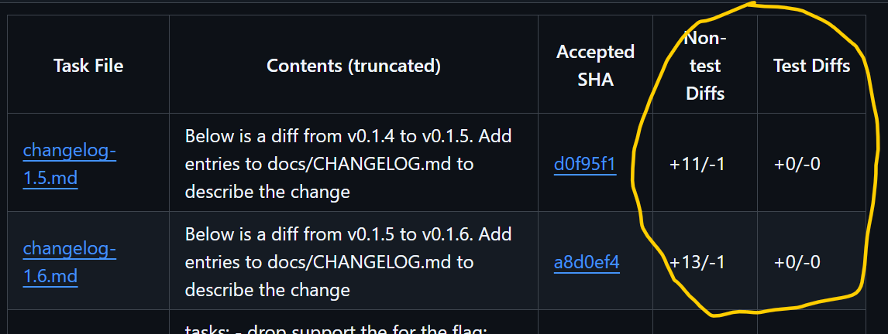

# Agro-builds-Agro pt 5
_July 16, 2025_

Let's look at augmenting the documentation-generating prompts (which we covered in [pt 3]) and exploring **the power of YOLO-mode / command execution** for agents. We're going to
- Write a prompt for documentation gathering
- Dispatch agents in yolo mode
- Review the results and compare agent performance

Sneak peek at the results: **claude** excels at yolo mode, **gemini-cli** is capable but not great at intent-matching / instruction-following, and **aider (in agent mode)** is not well suited to running these type of tasks

### The task

We're going to supplement our existing table [Dev-Summary](../dev-summary-v1.md) markdown tables with code diffs info for each solution. This will help us understand which the task size better form a high-level. So add the circled columns



This is a laborious task - adding information dozens of precise values into a markdown table so let's see if we can operate our agents effectively here.

The full prompt in [**summary-ag-1.md**](../../.public-agdocs/specs/summary-ag-1.md)
```md
update the table in docs/dev-summary-v1.md:
- update the table for v0.1.6
- add two new columns to the table for "code changes" / "diffs":
    - col1: diffs not in tests (e.g. src/ of at root)
    - col2: diffs in the tests/ dir
- each value should be represented as "+A/-D" where A is the number of additions and -D is deletion or modifications from a git diff / git diff --stat,
    - e.g. "+23/-12", or "+5/-0"

Use git commands to investigate these commit shas and run git diffs that will allows you to fill in the full table.

Rules used to build the table previously:
- only include specs/* files for rows
- sort by date order desc (the date information will supplied at the end)

Reference for commit sha's in the table
6bfdd22 docs: add dev-summary-v1
a2bf5ca release: v0.1.6
...
```

### Resources needed for Task Completion

**First we need command execution** to call to git. So an agent with just file-access that doesn't run commands won't be able to run get this information since the size of diffs don't like in any of the files in this repo [0].

There's two aspects to this LLM action:
- **Exact:** A script-like lookup of executing and parsing the results. In this case it's parsing the markdown for commit shas
    - Yes, we could write a script to do this, but agents obviously speed this up tremendously which is important for ad-hoc tasks. The most difficult part is parsing into and out-of markdown.
- **Fuzzy:** Some judgement and guestimation required to complete this in guessing from commit messages which specs it was implementing. For example in the previous documentation prompt we asked:
> - add a field that links to a 6-char git sha entry  on the github repo: github.com/sutt/agro. Do your best guess to find the corresponding commit (available with commit message below). If your guess is too uncertain, or it appears there is no commit for it, place an n/a for this entry.

So we can use our agents to do both exact and fuzzy type logic and minimize our work.

### Launching In Agro

YOLO mode is launched differently for the agents as a agent arg passed to the client:

```bash
agro exec summary-ag-1 claude --dangerously-skip-permissions
agro exec summary-ag-1 gemini  # gemini runs in -y mode by default
agro exec summary-ag-1 maider --yolo  # --yolo passed to maider to 
```
**How it works**
- **claude:** we pass the well known flag `--dangerously-skip-permissions` onto the claude command.
- **gemini:** is configured by default in agro to execute with `-y/--yolo` flag.
- **aider:** there actually is no true "yolo mode" in aider since when run non-interactively it cannot be configured. However there is a fork...

#### Maider as wrapper for Aider & Aider-YOLO

We can see that maider is a wrapper on aider that calls agentaider instead when yolo flag is passed. **agentaider** is the script name installed for a fork of aider which _does allow_ shell command to be called in the background. The fork works the exact same as aider just with the protection (**Run at your own risk!**). The repo for this fork can be found here: https://github.com/sutt/agent-aider

**maider**
```bash
...
command_to_run="aider"
for arg in "${pass_through_args[@]}"; do
    if [[ "$arg" == "--yolo" ]]; then
        command_to_run="agentaider"
        echo "CAUTION: yolo mode enabled ...using agentaider"
    fi
done

$command_to_run \
    "${args[@]}" \
    "${pass_through_args[@]}"
...
```


#### Configs for YOLO
For this task, it might take a lot of commands to complete so we're going to expand the timeout settings to ten minutes to twenty minutes and increase the `--max-turns` for the claude agent specifically.

**agro.conf.yml**
```yml
AGENT_CONFIG:
  claude:
    args: ["-d", "--allowedTools", "Write Edit MultiEdit", "--max-turns", "150", "-p"]  # change from default --max-turns=30

# Agent-specific timeout settings in seconds.
# A value of 0 means no timeout is applied, overriding any default.
AGENT_TIMEOUTS:
  aider: 0
  claude: 1200   # change from default 600
  gemini: 1200   # change from default 600

```

### Results

We've got the Good, the Weird, and the Ugly:
- 🏆 **Claude** - perceives and executes on intent; performs task accurately.
- 💖 **Gemini-CLI** - perfroms task accurately, adds unasked for niceties and weirdness.
- 😒 **Aider with Gemini** - perfroms the intent but inaccurately b/c it doesn't actually run nec. shell commands.

##### Claude Result

Reliable, accurate, just what I asked for.

| Task File | Contents (truncated) | Accepted SHA | Non-test Diffs | Test Diffs |
|------|-------------|---------|-------------|-----------|
| [changelog-1.5.md](../.public-agdocs/specs/changelog-1.5.md) | Below is a diff from v0.1.4 to v0.1.5. Add entries to docs/CHANGELOG.md to describe the change | [d0f95f1](https://github.com/sutt/agro/commit/d0f95f1) | +11/-1 | +0/-0 |
| [changelog-1.6.md](../.public-agdocs/specs/changelog-1.6.md) | Below is a diff from v0.1.5 to v0.1.6. Add entries to docs/CHANGELOG.md to describe the change | [a8d0ef4](https://github.com/sutt/agro/commit/a8d0ef4) | +13/-1 | +0/-0 |


##### Gemini Result
Gemini was a bit more of a wildcard, getting accurate results but doing
Helpfully:
- Instead of printing the literal file contents of the task files, gemini very helpfully summarized the prompt's intent,
- Reformatted the table's linking structure which made it more readable

Less Helpfull:

| Date       | Spec                 | Title                                       | Not-Tests | Tests    |
|------------|----------------------|---------------------------------------------|-----------|----------|
| 2025-07-16 | [changelog-1.5.md]   | Create changelog for v1.5                   | +11/-1    | +0/-0    |
| 2025-07-16 | [changelog-1.6.md]   | Create changelog for v1.6                   | +13/-1    | +0/-0    |
| 2025-07-16 | [clean-help.md]      | Update CLI help text                        | +19/-15   | +0/-0    |
| 2025-07-16 | [gemini-guide.md]    | Add gemini guide to agent context           | +22/-0    | +0/-0    |


In diff of the raw md file shows the readability improvement:
```diff

```

##### Aider Result

This one is revealing to see it get the intent right but be inaccurate. We have some ideas of why that might be, but let's save debugging for looking at the logs in the section below.

We can see intent is recognized and executed, but the actual values are slightly wrong, e.g. `+17/-16` instead of ground truth `+19/-15`

| Task File | Contents (truncated) | Accepted SHA | Diffs (not tests) | Diffs (tests) |
|------|-------------|---------|---|---|
| [changelog-1.5.md](../.public-agdocs/specs/changelog-1.5.md) | Below is a diff from v0.1.4 to v0.1.5. Add entries to docs/CHANGELOG.md to describe the change | [d0f95f1](https://github.com/sutt/agro/commit/d0f95f1) | +15/-0 | +0/-0 |
| [changelog-1.6.md](../.public-agdocs/specs/changelog-1.6.md) | Below is a diff from v0.1.5 to v0.1.6. Add entries to docs/CHANGELOG.md to describe the change | [a8d0ef4](https://github.com/sutt/agro/commit/a8d0ef4) | +17/-0 | +0/-0 |
| [clean-help.md](../.public-agdocs/specs/clean-help.md) | tasks: - drop support the for the flag: agro exec -t - update help for agro cli: - document agro state command - document -a option to exec | [8990066](https://github.com/sutt/agro/commit/8990066) | +17/-16 | +0/-0 |
| [gemini-guide.md](../.public-agdocs/specs/gemini-guide.md) | when launching a gemini agent from exec: - check if a .gemini directory exists in at the root of the git worktree when you go to launch | [b01a152](https://github.com/sutt/agro/commit/b01a152) | +11/-0 | +0/-0 |
| [clean-indices.md](../.public-agdocs/specs/clean-indices.md) | - drop support for -t arg in agro exec - port the branch pattern matching logic from "agro state" to "agro fade" - update the cli help text as nec. | [5f8a542](https://github.com/sutt/agro/commit/5f8a542) | +22/-37 | +0/-2 |

#### Looking at Logs

**Nota bene:** in agro, the logs (piped stdout/stderr) for agents can be found in `./trees/t<index>/,agswap/agro-exec.log` for each agent type.

We can see **claude** (see full logs [claude-summary-diff-1.log](./assets/claude-summary-diff-1.log)) that it was succesful in making the calls to `git diff --stat` and supplying a commit-sha.
```
[DEBUG] Bash tool invoked with command: git diff --stat a8d0ef4^..a8d0ef4
[DEBUG] Bash tool description: Get diff stats for changelog-1.6 commit
[DEBUG] Bash tool invoked with command: git diff --stat 8990066^..8990066
[DEBUG] Bash tool description: Get diff stats for clean-help commit
[DEBUG] Bash tool invoked with command: git diff --stat 2cacd2e^..2cacd2e
```

By counting the number of lines with certain patterns in looks like this took ~64 _turns_ in claude's terminology to complete.

We can see for **gemini-cli** we don't full debug logs we just get the high-level plan which includes:

>...
I will now proceed with reading the file.Okay, I have the file content. I will now proceed to gather the git diff statistics for each of the features listed in the v0.1.6 table. I will execute `git diff --stat` for each corresponding commit to get the additions and deletions, separating them into changes in the `tests` directory versus other source code changes.I have gathered the initial diff stats. To ensure accuracy for the `+A/-D` format, I will now re-run the `git diff` commands with the `--numstat` option. This will provide precise numbers of additions and deletions for each file, allowing me to correctly calculate the totals for "Not-Tests" and "Tests" changes.I have calculated the precise additions and deletions for each feature. I will now construct the updated markdown content
...

Even after re-running `gemini` with `-d` we still don't get to see the tool / command calls being made.

Finally looking at the **aider** / **agentaider** logs, we can go through them and (see full log here [.aider.chat.history.md](./assets/aba5-aider.chat.md)) to see if any shell commands were run. We can search for `: y` which will look for when `/add` or `/run` are automatically approved. So even with aider configured to run in yolo mode, it's not well suited to these tasks that require dozens of shell calls.

It is interesting to see how close to the correct values aider / the gemini model were able to guess for the diff numbers. This was likely a guesstimate by looking at the code files as they exists and guessing how much of the code is the result of generating for that spec, for example for the changelog commands, we can see how many lines are listed under each version and guess that the prompt must have added all those lines. You can see the [full generated table](./assets/aba5-aider-tbl.md) to compare the guesstimated vs actual.

### Conclusion

So what we've seen is that claude excels at documentation tasks and performing dozens of unsupervised shell commands in yolo mode, gemini-cli can perform the same capabilties but is not as smooth, and aider is poorly suited for this task.

Overall we've generated very useful information at minimal cost.

##### Footnotes
[0]: well, I guess it could look into `.git/` contents and construct this information somehow. But assuming there will be other situations where this info lives off the filesystem, like a remote database, and will need command execution to access.